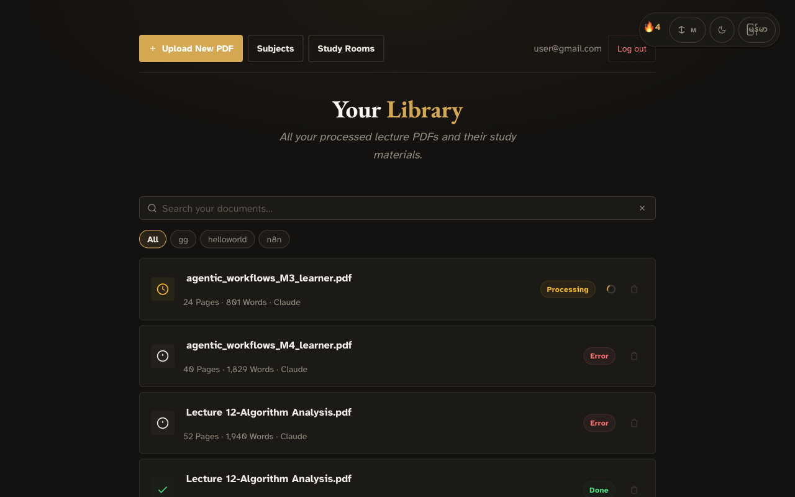
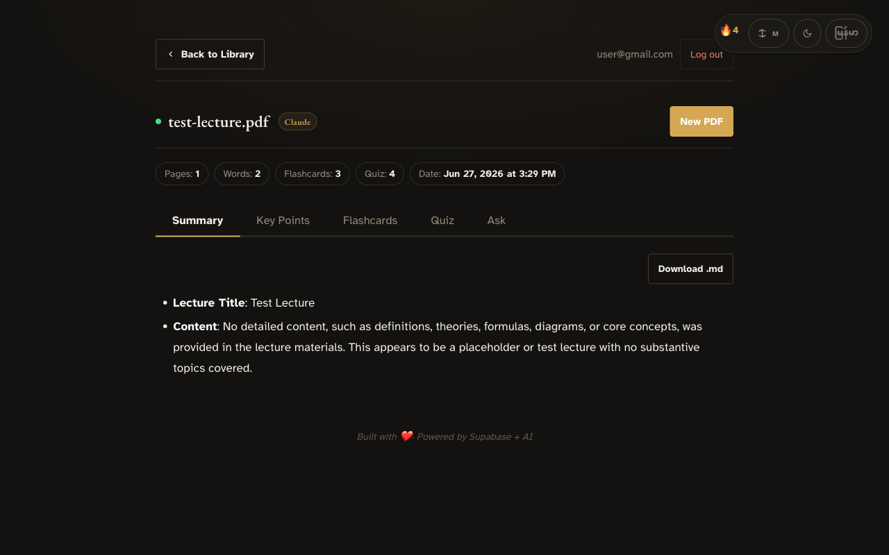
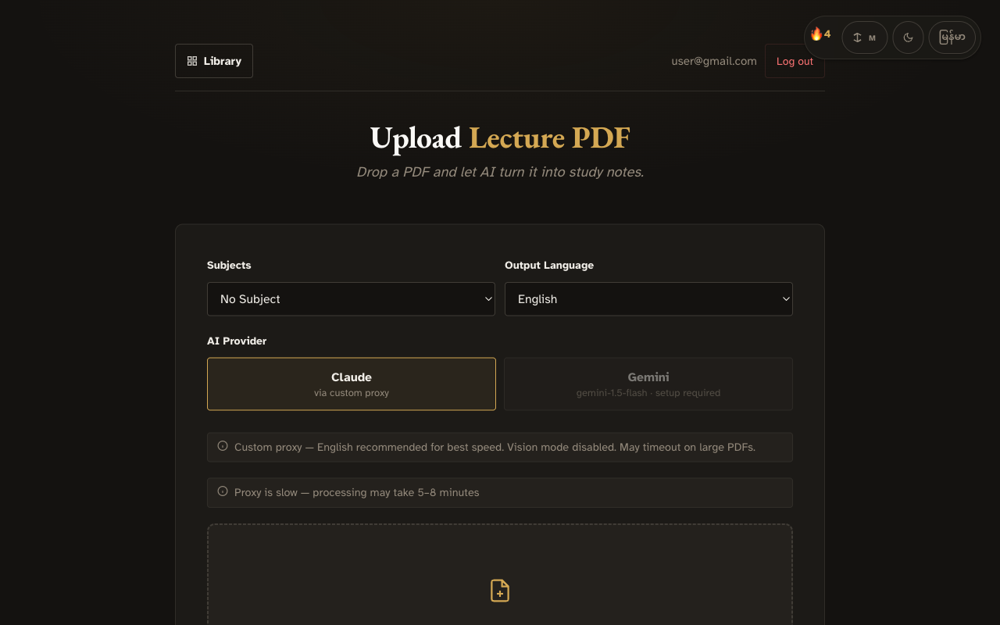
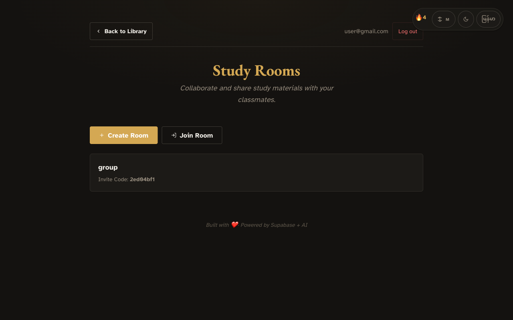

# Smart PDF Lecture Summarizer

Turn lecture PDFs into **summary notes**, **key exam points**, **Q&A flashcards**, and **quizzes** — powered by AI (Claude or Gemini).

🔗 **Live:** [pdf-summarizer-topaz.vercel.app](https://pdf-summarizer-topaz.vercel.app)

## Top Features

### 📤 AI-Powered PDF Analysis
Upload any lecture PDF (up to 25 MB) and AI generates a complete study kit — summary, key exam points, flashcards, and quiz — in one click. Supports both Claude and Gemini, with 6 output languages.


### 📚 Smart Library & Full-Text Search
Every processed document is saved with page count, word count, and study-material counts. Search across all your documents instantly with PostgreSQL full-text search, filter by subject, or sort by date.



### 🃏 Interactive Flashcards & SRS Review
Click-to-flip flashcards for active recall, plus a spaced-repetition review system (SM-2 algorithm) that schedules cards for optimal retention. Built-in quiz mode tests your understanding with auto-graded questions.



## More Screenshots

| Login | Study Rooms |
|:-----:|:-----------:|
|  |  |

## Features

- **AI Processing** — Claude (default, via custom proxy) or Gemini generates summary, key points, flashcards, and quiz
- **Multi-language** — Output in English, Myanmar, Chinese, Japanese, Korean, or Thai
- **PDF Vision Mode** — AI sees figures and diagrams (official Anthropic API)
- **Spaced Repetition (SRS)** — SM-2 algorithm schedules flashcard reviews for optimal retention
- **Study Rooms** — Create rooms, share documents, collaborate via invite codes
- **Full-text Search** — PostgreSQL FTS across all documents with instant results
- **Dark/Light Theme** — Swiss academic design with font-size controls
- **Bilingual UI** — English and Myanmar (Burmese) interface
- **Progress Tracking** — Real-time processing pipeline with ETA, chunk-by-chunk progress, heartbeat
- **Chat with PDF** — Conversational Q&A over any processed document
- **Organization** — Tag documents by subject, rename files before processing

## Quick Start

```bash
cd frontend
python3 -m http.server 3000
# Open http://localhost:3000
```

## Architecture

```
frontend/ (localhost:3000)          Supabase Cloud
┌──────────────────┐           ┌─────────────────────┐
│ Login / Signup    │───JWT────│ Supabase Auth        │
│ Upload PDF        │──Storage─│ Supabase Storage      │
│ Library (history) │──DB──────│ Supabase Postgres    │
│ View Results      │──EdgeFn──│ Edge Function        │
│ Study Rooms       │           │                     │
└──────────────────┘           └─────────────────────┘
```

## Tech Stack

| Layer | Technology |
|-------|-----------|
| Frontend | HTML + CSS + Vanilla JS (ES modules, no bundler) |
| Auth | Supabase Auth (email/password) |
| Backend | Supabase Edge Functions (Deno/TypeScript) |
| Database | Supabase Postgres with RLS + Full-Text Search |
| Storage | Supabase Storage |
| PDF Parsing | pdf-parse (npm) |
| AI | Claude API / Gemini API |
| Hosting | Vercel (static site) + Supabase (backend) |

## Project Structure

```
smart_pdf_lecture_summarizer/
├── frontend/                  # Static HTML/CSS/JS (served by Vercel)
│   ├── index.html             # Login
│   ├── signup.html            # Signup
│   ├── upload.html            # Upload + AI processing
│   ├── library.html           # Document library with search
│   ├── view.html              # View outputs & chat with PDF
│   ├── review.html            # Spaced-repetition flashcards
│   ├── rooms.html             # Study rooms list
│   ├── room.html              # Single study room
│   ├── subjects.html          # Subject management
│   ├── css/style.css          # Swiss academic design, light/dark
│   └── js/
│       ├── supabase-client.js
│       ├── app.js, auth.js, i18n.js
│       ├── page-init.js, shared-ui.js, ui-init.js
│       ├── chat.js, srs.js, subjects.js, rooms.js, streak.js
│       └── toast.js, confirm.js, font-size.js
├── supabase/
│   ├── functions/
│   │   ├── process-pdf/       # AI processing Edge Function
│   │   └── chat-pdf/          # Conversational Q&A Edge Function
│   └── migrations/            # Database schema (001–009)
├── slides/                    # Product-intro pitch deck
├── images/                    # Screenshots (1280×800)
├── vercel.json                # Vercel deployment config
└── README.md
```

## Setup

### Prerequisites

- A Supabase project
- Claude API key (`ANTHROPIC_API_KEY`) or Gemini API key (`GEMINI_API_KEY`)

### Configure Secrets

```bash
npx supabase secrets set ANTHROPIC_API_KEY=sk-ant-...
npx supabase secrets set ANTHROPIC_BASE_URL=https://proxy.example.com  # optional
npx supabase secrets set GEMINI_API_KEY=...   # optional
```

### Deploy Edge Functions

```bash
npx supabase functions deploy process-pdf
npx supabase functions deploy chat-pdf
```

### Run Frontend

```bash
cd frontend
python3 -m http.server 3000
```

## Security

- JWT authentication via Supabase Auth
- Row Level Security (RLS) on all database tables
- Storage RLS: users can only access `{user_id}/` folders
- PDFs uploaded directly to Storage (bypasses Edge Function body limits)
- AI provider keys stored as Supabase secrets (never exposed to browser)

---

*Built with [Claude Code](https://claude.ai/code) · Powered by Supabase + Claude/Gemini AI*
