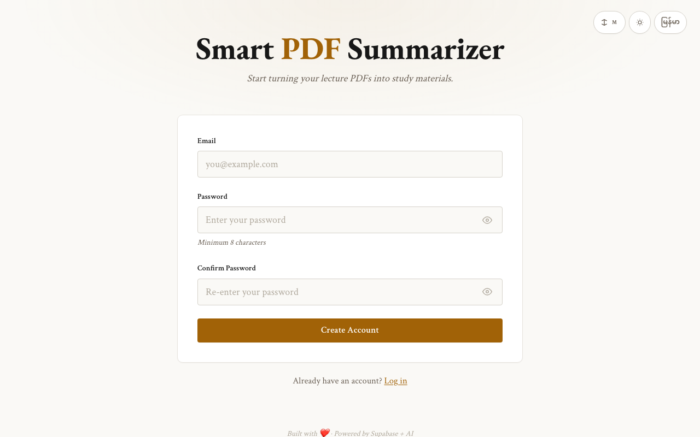

# Smart PDF Lecture Summarizer

Turn lecture PDFs into **summary notes**, **key exam points**, and **Q&A flashcards** — powered by AI, with user accounts and cloud storage.

## Screenshots

| Login | Signup | Upload |
|:-----:|:------:|:------:|
|  |  |  |

| Library | View |
|:-------:|:----:|
|  |  |

## Quick Start

```bash
# 1. Serve the frontend locally
cd frontend
python3 -m http.server 3000

# 2. Open in browser
open http://localhost:3000
```

## Architecture

```
frontend/ (localhost:3000)          Supabase Cloud
┌──────────────────┐           ┌─────────────────────┐
│ Login / Signup    │───JWT────│ Supabase Auth        │
│ Upload PDF        │──Storage─│ Supabase Storage      │
│ Library (history) │──DB──────│ Supabase Postgres    │
│ View Results      │──EdgeFn──│ Edge Function        │
└──────────────────┘           └─────────────────────┘
```

## Features

- **User accounts** — email + password signup/login via Supabase Auth
- **Drag & drop upload** — upload lecture PDFs (max 25 MB)
- **AI processing** — Claude (default) or Gemini generates study materials
- **Cloud storage** — all files stored in Supabase, accessible from any device
- **Persistent history** — Library shows all past uploads with status
- **Interactive flashcards** — click-to-flip cards for active recall
- **Dark theme** — purple/green dark mode, mobile responsive

## Setup

### Prerequisites

- A Supabase project (already configured: `efkraurkqiavqdilkjpt`)
- Claude API key (`ANTHROPIC_API_KEY`) or Gemini API key (`GEMINI_API_KEY`)

### Set API Key Secrets

Set your AI provider API key(s) in Supabase:

1. Go to [Supabase Dashboard](https://supabase.com/dashboard/project/efkraurkqiavqdilkjpt/settings/functions)
2. Add secrets:
   - `ANTHROPIC_API_KEY` = `sk-ant-...` (for Claude)
   - `GEMINI_API_KEY` = `...` (for Gemini)

Or via CLI:
```bash
npx supabase secrets set ANTHROPIC_API_KEY=sk-ant-...
npx supabase secrets set GEMINI_API_KEY=...
```

### Start the App

```bash
cd frontend
python3 -m http.server 3000
```

Open **http://localhost:3000** in your browser.

## Pages

| Page | File | Description |
|------|------|-------------|
| Login | `index.html` | Email + password sign in |
| Signup | `signup.html` | Create account |
| Upload | `upload.html` | Upload PDF → get study materials |
| Library | `library.html` | View all past uploads |
| View | `view.html?id=<id>` | Re-read summary, key points, flashcards |

## Project Structure

```
smart_pdf_lecture_summarizer/
├── frontend/              # Static HTML/CSS/JS (served locally)
│   ├── index.html         # Login
│   ├── signup.html        # Signup
│   ├── upload.html        # Upload + process
│   ├── library.html       # Document history
│   ├── view.html          # View outputs
│   ├── css/style.css      # Styles (dark theme, purple/green)
│   └── js/
│       ├── supabase-client.js  # Supabase SDK init
│       ├── auth.js        # Auth helpers
│       └── app.js         # Shared utilities
├── supabase/
│   ├── functions/process-pdf/  # Edge Function
│   │   ├── index.ts       # Main handler
│   │   ├── prompts.ts     # AI prompts
│   │   ├── extract.ts     # PDF text extraction
│   │   └── deno.json      # Deno imports
│   └── migrations/
│       └── 001_create_documents_table.sql
├── design.md              # Technical design
├── PROPOSAL.md            # Vision & scope
└── README.md              # This file
```

## API Keys & Security

- AI provider keys are stored as **Supabase secrets** — never exposed to the browser
- User authentication via Supabase Auth (JWT)
- Row Level Security on database: users can only see their own documents
- Storage RLS: users can only access files in their `{user_id}/` folder
- PDFs uploaded directly to Storage (bypasses Edge Function body limits)

## Tech Stack

| Layer | Technology |
|-------|-----------|
| Frontend | HTML + CSS + Vanilla JS |
| Auth | Supabase Auth (email/password) |
| Backend | Supabase Edge Function (Deno/TypeScript) |
| Storage | Supabase Storage |
| Database | Supabase Postgres |
| PDF Parsing | pdf-parse (npm) |
| AI | Claude API / Gemini API |

---

*Built with Supabase + Claude/Gemini AI*
