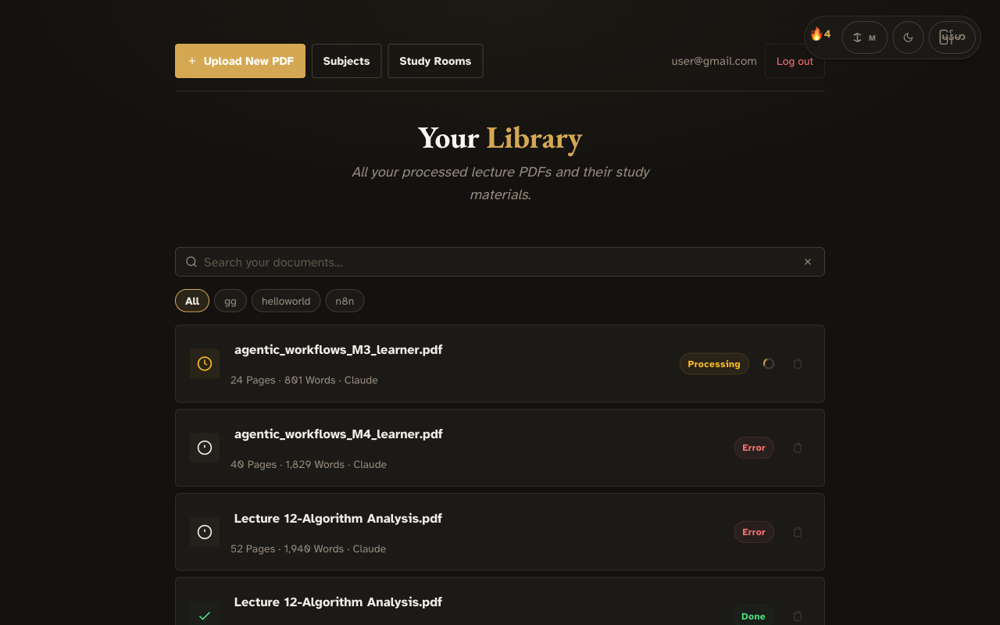
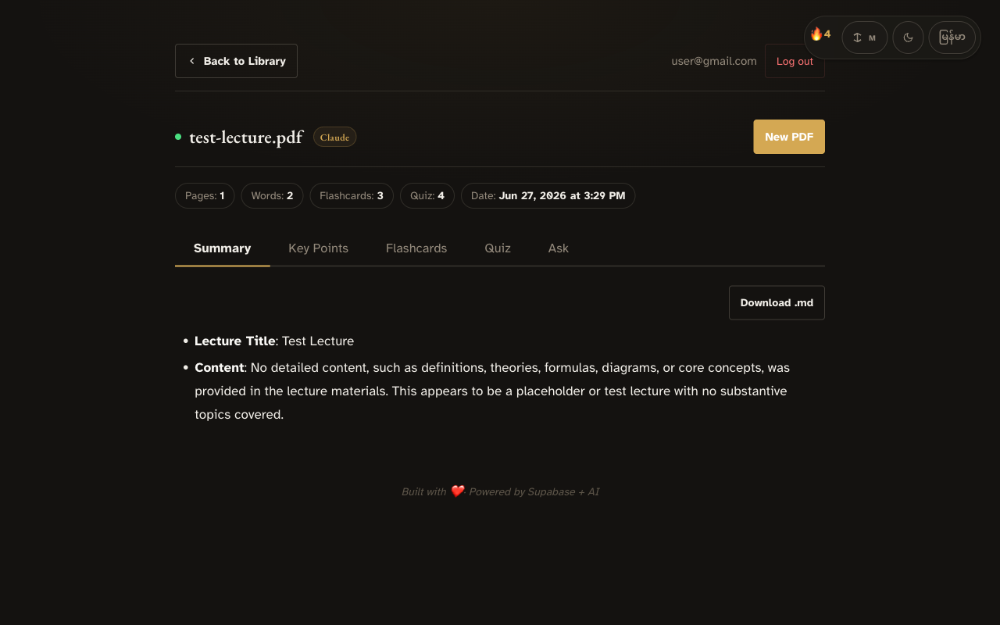
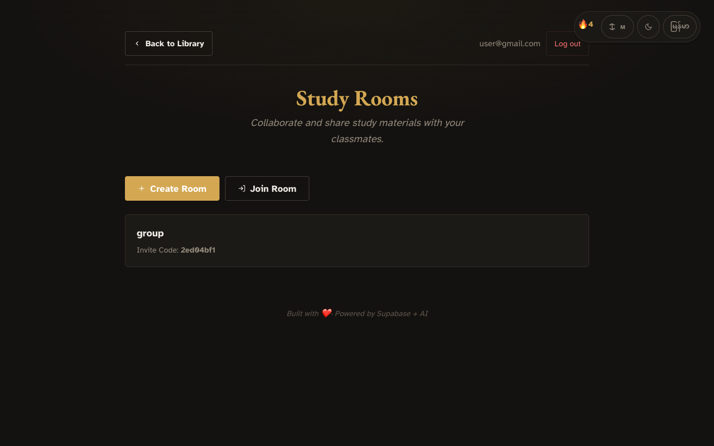
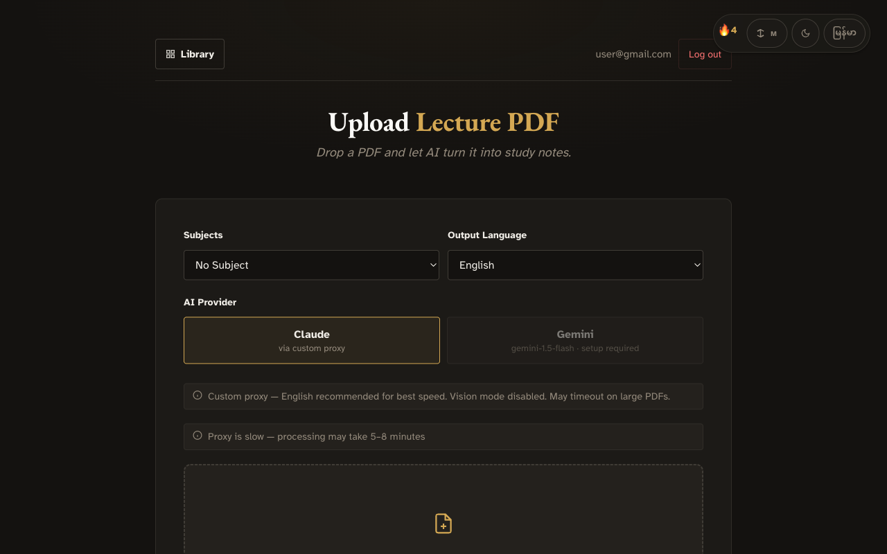

# Smart PDF Lecture Summarizer

**Upload a lecture PDF. Get a complete study kit — summary, flashcards, quiz — in one click.**


*Upload → AI processing → polished study materials, start to finish.*

---

## For Students & Lecturers

Tired of re-reading hundred-page lecture PDFs to find what matters? Drop one in, and the AI extracts the essence — definitions, formulas, diagrams, exam-worthy concepts — then packages it into everything you need to study or teach:

- **Bullet-point summary** organized by topic
- **Exam-ready key points** ranked by priority (high / medium / common pitfalls)
- **Click-to-flip flashcards** with spaced repetition scheduling (SM-2)
- **Multiple-choice quiz** with auto-grading and explanations

Supports **English, Burmese (မြန်မာ), Chinese, Japanese, Korean, and Thai** — both UI and AI output.

🔗 **Live:** [pdf-summarizer-topaz.vercel.app](https://pdf-summarizer-topaz.vercel.app)

---

## Quick Start

```bash
cd frontend
python3 -m http.server 3000
# → http://localhost:3000
```

There's no build step. Open the browser, sign up, and upload a PDF.

---

## Features

| | |
|---|---|
| 🧠 **AI Analysis** | Claude (default) or Gemini extracts summary, key points, flashcards, and quiz. Vision mode reads figures and diagrams. |
| 🗂️ **Smart Library** | Full-text search across all documents. Tag by subject, sort by date, see page/word counts at a glance. |
| 🃏 **Spaced Repetition** | SM-2 algorithm schedules flashcard reviews for optimal exam retention. Auto-graded quiz mode. |
| 💬 **Chat with PDF** | Conversational Q&A over any processed document — ask follow-ups, dive deeper into topics. |
| 👥 **Study Rooms** | Create rooms, share documents with classmates, study together via invite codes. |
| 🌐 **Bilingual UI** | Switch between English and Myanmar (Burmese) with one click. AI output in 6 languages. |
| 🎨 **Themes** | Light / dark with warm glass-morphism design. Font-size controls for comfortable reading. |
| 📊 **Progress Tracking** | Real-time processing pipeline with per-chunk progress, heartbeat timer, and ETA. |
| 🔒 **Private by Default** | JWT auth, Row Level Security, per-user storage folders. |

---

## Screenshots

| Library | Flashcards | Study Room |
|:-------:|:----------:|:----------:|
|  |  |  |

| Login | Mobile |
|:-----:|:------:|
|  | Fully responsive — works on phones and tablets |

---

## Architecture

```
Browser (vanilla JS)              Supabase Cloud
┌──────────────────────┐          ┌─────────────────────────────┐
│ Login / Signup        │──JWT───│ Supabase Auth                │
│ Upload PDF            │─Store──│ Supabase Storage (pdfs/)     │
│ Library / Search      │──DB────│ Postgres + RLS + FTS         │
│ Flashcards / Quiz     │─EdgeFn─│ process-pdf · chat-pdf       │
│ Study Rooms           │         │ (Deno / TypeScript)          │
└──────────────────────┘         └─────────────────────────────┘
```

**Frontend** — Static HTML + CSS + Vanilla JS (ES modules via `esm.sh` CDN). No bundler, no framework.

**Backend** — Two Supabase Edge Functions (Deno/TypeScript):
- `process-pdf` — Downloads PDF from Storage, extracts text, calls AI, writes markdown outputs
- `chat-pdf` — Conversational Q&A over an already-processed document

**Database** — Supabase Postgres with Row Level Security. 9 migrations cover documents, subjects, flashcards, study rooms, streaks, and full-text search.

---

## Tech Stack

| | |
|---|---|
| **Hosting** | Vercel (static site) + Supabase (backend) |
| **Auth** | Supabase Auth — email/password |
| **Database** | Supabase Postgres — RLS, FTS, SM-2 scheduler |
| **Storage** | Supabase Storage — `pdfs` (25 MB) + `outputs` (10 MB) |
| **Edge Functions** | Deno / TypeScript — `pdf-parse`, Claude API, Gemini API |
| **AI** | Claude (default) via Anthropic API + Gemini (optional) |
| **CSS** | Liquid Glass design system — warm translucent surfaces, gold luminance, glass blur |
| **Fonts** | EB Garamond (headings) · Atkinson Hyperlegible (body) |

---

## Project Structure

```
smart_pdf_lecture_summarizer/
├── frontend/                    # Static site (served by Vercel)
│   ├── index.html               # Login
│   ├── signup.html              # Create account
│   ├── upload.html              # Upload + AI processing
│   ├── library.html             # Document library + search
│   ├── view.html                # View outputs + chat
│   ├── review.html              # Spaced-repetition flashcards
│   ├── rooms.html               # Study room list
│   ├── room.html                # Single room view
│   ├── subjects.html            # Subject tags
│   ├── css/style.css            # Design system (light + dark)
│   └── js/                      # ES modules, no bundler
│       ├── supabase-client.js   # Supabase SDK wrapper
│       ├── auth.js              # Login / signup / session
│       ├── i18n.js              # Bilingual (EN + MY)
│       ├── page-init.js         # Shared page boot
│       ├── shared-ui.js         # Nav bar injector
│       ├── ui-init.js           # Theme, lang, font init
│       ├── srs.js               # SM-2 spaced repetition
│       ├── chat.js              # PDF chat UI
│       ├── rooms.js             # Study rooms API
│       ├── subjects.js          # Subject tag CRUD
│       ├── streak.js            # Daily streak tracker
│       └── theme-pullcord.js    # PullCord theme toggle (React)
├── supabase/
│   ├── functions/
│   │   ├── process-pdf/         # AI processing (Deno)
│   │   └── chat-pdf/            # PDF Q&A (Deno)
│   └── migrations/              # 001–009 schema
├── images/                      # Screenshots (1280×800)
├── vercel.json
└── README.md
```

---

## Setup

### Prerequisites

- A Supabase project with the [9 migrations](supabase/migrations/) applied
- An [Anthropic API key](https://console.anthropic.com) (Claude) — required
- A [Google AI Studio key](https://aistudio.google.com) (Gemini) — optional

### Environment

Edge Function secrets are set via the Supabase CLI or dashboard:

```bash
npx supabase secrets set ANTHROPIC_API_KEY=sk-ant-...
npx supabase secrets set ANTHROPIC_BASE_URL=https://your-proxy.example.com  # optional
npx supabase secrets set GEMINI_API_KEY=...   # optional
```

### Deploy Edge Functions

```bash
npx supabase functions deploy process-pdf
npx supabase functions deploy chat-pdf
```

### Run Locally

```bash
cd frontend
python3 -m http.server 3000
```

No npm install. No build. Open `http://localhost:3000`.

> **Note:** Local Supabase storage uploads require CORS to be configured for `localhost:3000` in the Supabase dashboard.

---

## Security

- **JWT authentication** — all API requests require a valid session token
- **Row Level Security** — every table has per-user policies
- **Storage RLS** — users can only access their own `{user_id}/` folder
- **Direct-to-storage uploads** — PDFs bypass Edge Function body limits
- **AI keys stored as secrets** — never exposed to the browser

---

*Built with [Claude Code](https://claude.ai/code) · Powered by [Supabase](https://supabase.com) + [Claude](https://anthropic.com/claude) / [Gemini](https://deepmind.google/gemini/)*
